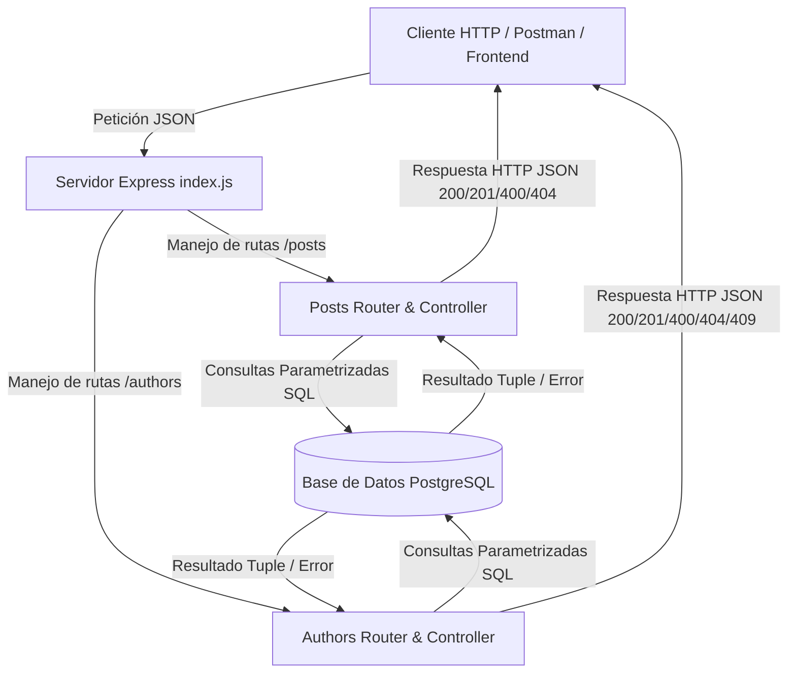
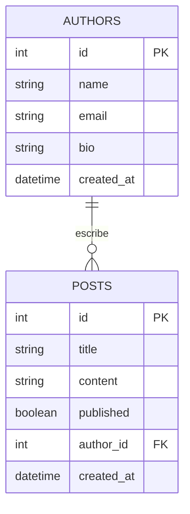

# MiniBlog API — Proyecto Integrador Módulo 2

API RESTful desarrollada en Node.js, Express y PostgreSQL para la gestión integral de autores y publicaciones de blog (posts), con soporte de pruebas de integración automatizadas y documentación bajo el estándar OpenAPI 3.0.3.

**Estado del proyecto:** Finalizado / Funcional
**Tecnologías principales:** Node.js (ES Modules), Express 5.2.1, PostgreSQL (pg 8.23.0), Vitest 5.0.1, Supertest 7.2.2, OpenAPI 3.0.3

## Índice de contenidos

- [Descripción del proyecto](#descripción-del-proyecto)
- [Objetivos](#objetivos)
  - [Objetivo general](#objetivo-general)
  - [Objetivos específicos](#objetivos-específicos)
- [Relación con el Módulo 2](#relación-con-el-módulo-2)
- [Características y funcionalidades](#características-y-funcionalidades)
- [Tecnologías utilizadas](#tecnologías-utilizadas)
- [Arquitectura del proyecto](#arquitectura-del-proyecto)
- [Estructura de carpetas](#estructura-de-carpetas)
- [Requisitos previos](#requisitos-previos)
- [Instalación](#instalación)
- [Configuración](#configuración)
- [Ejecución](#ejecución)
- [Guía de uso](#guía-de-uso)
- [Evidencias del funcionamiento](#evidencias-del-funcionamiento)
- [Sobre el uso de IA](#sobre-el-uso-de-ia)
  - [Evidencia del uso de IA](#evidencia-del-uso-de-ia)
  - [Prompts utilizados durante el proyecto](#prompts-utilizados-durante-el-proyecto)
  - [Tabla resumen de utilización de IA](#tabla-resumen-de-utilización-de-ia)
  - [Cómo influyó la IA en el desarrollo](#cómo-influyó-la-ia-en-el-desarrollo)
  - [Aprendizaje obtenido mediante el uso de IA](#aprendizaje-obtenido-mediante-el-uso-de-ia)
  - [Participación humana y validación](#participación-humana-y-validación)
- [Pruebas](#pruebas)
- [Manejo de errores](#manejo-de-errores)
- [Seguridad](#seguridad)
- [Base de datos](#base-de-datos)
- [API](#api)
- [Decisiones técnicas](#decisiones-técnicas)
- [Limitaciones](#limitaciones)
- [Mejoras futuras](#mejoras-futuras)
- [Conclusiones](#conclusiones)
- [Referencias](#referencias)

## Descripción del proyecto

MiniBlog API es el backend de una plataforma de publicaciones liviana diseñada para gestionar el ciclo de vida completo de autores y sus artículos asociados. El sistema resuelve el problema de organizar y consultar información estructurada mediante un modelo relacional entre dos entidades clave: Autores y Publicaciones (Posts).

El sistema permite crear, consultar, actualizar y eliminar autores y posts, garantizando la integridad referencial de los datos a través de reglas como la eliminación en cascada de publicaciones al remover un autor. Fue desarrollado como Proyecto Integrador dentro del entorno académico del Módulo 2 para consolidar el diseño de servicios web backend robustos, manejo de bases de datos relacionales, modularización mediante arquitectura de rutas/controladores, pruebas automatizadas y especificación de contratos mediante OpenAPI.

## Objetivos

### Objetivo general

Diseñar e implementar una API RESTful completamente funcional utilizando Node.js, Express y PostgreSQL para administrar autores y publicaciones, garantizando persistencia relacional, manejo estructurado de errores, pruebas de integración automatizadas y documentación estandarizada.

### Objetivos específicos

- Modelar una base de datos relacional PostgreSQL con tablas vinculadas por claves foráneas y restricciones de unicidad e integridad (`ON DELETE CASCADE`).
- Implementar un servidor HTTP modularizado en Express utilizando módulos de ECMAScript (`import`/`export`).
- Construir endpoints REST con respuestas acordes a los códigos de estado HTTP estándar (200, 201, 400, 404, 409, 500).
- Garantizar la calidad del código mediante pruebas de integración automatizadas utilizando Vitest y Supertest.
- Especificar con precisión el contrato de la API mediante la especificación OpenAPI 3.0.3 (`openapi.yaml`).
- Documentar de manera transparente el uso colaborativo de herramientas de Inteligencia Artificial en el proceso de arquitectura, depuración y aprendizaje.

## Relación con el Módulo 2

El desarrollo del proyecto MiniBlog API permitió aplicar de manera práctica e integrada los temas abordados a lo largo del Módulo 2:

- **Desarrollo Backend con Node.js y Express:** Se estructuró la aplicación utilizando el sistema de módulos de ES (`"type": "module"`), separando el servidor principal (`index.js`), las rutas (`src/routes/`) y los controladores/modelos de la base de datos.
- **Bases de datos relacionales y SQL con PostgreSQL:** Se aplicaron conceptos de modelado relacional mediante scripts DDL/DML (`sql/setup.sql` y `sql/seed.sql`), consultas parametrizadas a través de la librería `pg`, prevención de inyección SQL, restricciones de unicidad (`UNIQUE` en `email`) y mantenimiento de integridad referencial.
- **Variables de entorno y configuración:** Se implementó `dotenv` para aislar las credenciales del sistema del código fuente mediante archivos `.env` y `.env.example`, garantizando prácticas seguras de desarrollo.
- **Pruebas automatizadas e integración continua:** Se aplicó el desacople de la instanciación de Express respecto a la escucha del puerto (`process.env.NODE_ENV !== "test"`), permitiendo que herramientas como Vitest y Supertest ejecuten pruebas sobre las rutas (`test/api.test.js`) sin colisionar con sockets de red activos.
- **Resolución de problemas técnicos:** Durante el desarrollo se abordaron retos como el manejo del error de emails duplicados (código PostgreSQL `23505` mapeado a `409 Conflict`) y la sincronización asíncrona de transacciones en la base de datos.

## Características y funcionalidades

### 1. Gestión de Autores (CRUD)

- **Descripción:** Administra el registro de usuarios que redactan publicaciones.
- **Objetivo:** Registrar, listar, consultar por ID, actualizar información de perfil y eliminar autores del sistema.
- **Entrada:** Objetos JSON con atributos `name`, `email` y opcionalmente `bio`.
- **Proceso:** Validación de campos obligatorios, verificación de unicidad de correo electrónico en PostgreSQL y persistencia en la tabla `authors`.
- **Resultado:** Objeto del autor creado o modificado con marca de tiempo `created_at` o confirmación de eliminación.
- **Usuario:** Administrador del sistema / Cliente API.

### 2. Gestión de Publicaciones (CRUD)

- **Descripción:** Administra las entradas del blog creadas por los autores.
- **Objetivo:** Permitir la creación, edición, filtrado y eliminación de posts asociados a un autor válido.
- **Entrada:** Objetos JSON con `title`, `content`, `author_id` y estado de publicación (`published`).
- **Proceso:** Verificación de la existencia previa del `author_id` mediante claves foráneas y ejecución de operaciones DML en PostgreSQL.
- **Resultado:** Confirmación de persistencia e inclusión del nombre del autor (`author_name`) en las lecturas mediante `JOIN`s en SQL.
- **Usuario:** Autor de contenido / Administrador.

### 3. Eliminación en cascada

- **Descripción:** Regla de negocio e integridad referencial.
- **Objetivo:** Mantener consistente la base de datos eliminando automáticamente los posts asociados cuando su autor es removido.
- **Entrada:** ID de un autor a través de `DELETE /authors/{id}`.
- **Proceso:** Disparo de la restricción `FOREIGN KEY (author_id) REFERENCES authors(id) ON DELETE CASCADE`.
- **Resultado:** Eliminación del autor y de todas sus publicaciones vinculadas.

### 4. Consulta de posts por autor

- **Descripción:** Endpoint específico de filtrado.
- **Objetivo:** Obtener en una sola consulta la lista de artículos pertenecientes a un autor específico.
- **Entrada:** Parámetro de ruta `authorid` en `GET /posts/author/{authorid}`.
- **Proceso:** Filtrado `WHERE author_id = $1` en la tabla de posts.
- **Resultado:** Array con las publicaciones encontradas o código `404` si el autor no existe.

## Tecnologías utilizadas

| Tecnología | Versión | Uso en el proyecto |
|---|---|---|
| Node.js | >= 18.0.0 | Entorno de ejecución de JavaScript en el servidor |
| Express | 5.2.1 | Framework web para la creación de rutas, middlewares y servicios REST |
| PostgreSQL (pg) | 8.23.0 | Sistema de gestión de base de datos relacional y cliente de conexión |
| Dotenv | 17.4.2 | Gestión e inyección de variables de entorno desde archivo `.env` |
| Vitest | 5.0.1 | Framework para la ejecución de pruebas unitarias e integración |
| Supertest | 7.2.2 | Librería de simulación de solicitudes HTTP para pruebas de integración |
| OpenAPI Specification | 3.0.3 | Estándar de documentación de la API en YAML (`openapi.yaml`) |
| Herramientas de IA | — | Apoyo en la arquitectura, resolución de errores y generación de documentación |

## Arquitectura del proyecto

El sistema adopta un modelo de arquitectura en capas (Cliente - Servidor - Base de datos) desacoplado, utilizando middlewares de Express para el procesamiento intermedio y formateo de datos.



## Estructura de carpetas

```
ProyectoM2_AndresLozano/
├── node_modules/
├── sql/
│   ├── seed.sql
│   └── setup.sql
├── src/
│   ├── config/
│   │   └── db.js
│   ├── controllers/
│   │   ├── authors.controller.js
│   │   └── posts.controller.js
│   └── routes/
│       ├── authors.routes.js
│       └── posts.routes.js
├── test/
│   └── api.test.js
├── .env
├── .env.example
├── .gitignore
├── index.js
├── openapi.yaml
├── package-lock.json
├── package.json
└── README.md
```

### Explicación de archivos principales

- **`index.js`:** Punto de entrada de la aplicación. Configura middlewares, define las rutas principales (`/posts`, `/authors`), el middleware global de errores y exporta `app` para pruebas.
- **`sql/setup.sql`:** Script de creación DDL para tablas (`authors`, `posts`), restricciones de clave foránea y borrado en cascada.
- **`sql/seed.sql`:** Script de carga DML para datos iniciales de prueba.
- **`test/api.test.js`:** Suite de pruebas de integración con Vitest y Supertest que evalúa todos los endpoints de la API.
- **`openapi.yaml`:** Definición OpenAPI 3.0.3 con especificación de esquemas, parámetros y respuestas.
- **`package.json`:** Configuración de scripts (`start`, `dev`, `test`), tipo de módulos ES (`"type": "module"`) y dependencias.
- **`.env` / `.env.example`:** Configuración de variables de entorno para la conexión a PostgreSQL y puerto del servidor.

## Requisitos previos

- **Sistema Operativo:** Windows, macOS o Linux.
- **Entorno de ejecución:** Node.js (Versión 18.x o superior).
- **Gestor de paquetes:** npm (incluido con Node.js).
- **Base de datos:** Motor PostgreSQL (v12 o superior) ejecutándose en `localhost:5432` o servidor accesible.

## Instalación

1. Clonar el repositorio:

```bash
git clone https://github.com/usuario/ProyectoM2_AndresLozano.git
cd ProyectoM2_AndresLozano
```

2. Instalar dependencias del proyecto:

```bash
npm install
```

3. Crear y poblar la base de datos en PostgreSQL. Acceder a la consola `psql` o cliente SQL y ejecutar:

```sql
CREATE DATABASE miniblog;
```

Ejecutar el esquema inicial y los datos semilla:

```bash
psql -U postgres -d miniblog -f sql/setup.sql
psql -U postgres -d miniblog -f sql/seed.sql
```

## Configuración

Crear un archivo `.env` en la raíz basándose en `.env.example` para establecer conexión con PostgreSQL:

| Variable | Descripción | Obligatoria | Ejemplo |
|---|---|---|---|
| `PORT` | Puerto en el que escucha el servidor Express | Sí | `3000` |
| `DB_USER` | Usuario administrador de PostgreSQL | Sí | `postgres` |
| `DB_PASSWORD` | Contraseña del usuario de base de datos | Sí | `password` |
| `DB_HOST` | Host del servidor de base de datos | Sí | `localhost` |
| `DB_PORT` | Puerto del servicio PostgreSQL | Sí | `5432` |
| `DB_NAME` | Nombre de la base de datos | Sí | `miniblog` |

Ejemplo de contenido para `.env`:

```env
PORT=3000
DB_USER=postgres
DB_PASSWORD=password
DB_HOST=localhost
DB_PORT=5432
DB_NAME=miniblog
```

## Ejecución

**Modo desarrollo** (con recarga automática mediante Node watch):

```bash
npm run dev
```

**Modo producción:**

```bash
npm start
```

**Ejecución de pruebas automatizadas (Vitest):**

```bash
npm test
```

Resultado esperado al iniciar:

```
Servidor corriendo en http://localhost:3000
```

## Guía de uso

**Verificación de estado del servidor:**
Realizar una petición `GET http://localhost:3000/` desde un navegador o cliente HTTP.
Resultado esperado: Texto "¡API de MiniBlog funcionando correctamente!" con código `200 OK`.

**Crear un Autor:**
Enviar una petición `POST http://localhost:3000/authors` con el cuerpo JSON:

```json
{
  "name": "Andrés Lozano",
  "email": "andres@example.com",
  "bio": "Desarrollador y analista de calidad."
}
```

Resultado esperado: Código `201 Created` y retorno del objeto con `id` asignado.

**Crear una Publicación:**
Enviar una petición `POST http://localhost:3000/posts` indicando el `author_id` correspondiente:

```json
{
  "title": "Mi primera publicación",
  "content": "Contenido detallado de la primera publicación en MiniBlog.",
  "author_id": 1
}
```

Resultado esperado: Código `201 Created`.

**Consultar Publicaciones:**
Enviar `GET http://localhost:3000/posts` para obtener todas las publicaciones registradas con la información combinada del autor.

## Evidencias del funcionamiento

- **Evidencia 01 — Verificación del Servidor y Lista de Autores:** Demuestra la correcta respuesta de la API en la ruta raíz y la consulta exitosa del listado de autores mediante petición HTTP GET.
- **Evidencia 02 — Creación de Publicación e Integridad Referencial:** Demuestra el funcionamiento de la inserción de nuevos posts vinculados a un autor existente en la base de datos PostgreSQL.
- **Evidencia 03 — Ejecución Exitosa de Pruebas Automatizadas:** Demuestra que la suite de pruebas en `test/api.test.js` ejecutada con Vitest y Supertest finaliza sin errores.

## Sobre el uso de IA

Durante el desarrollo de MiniBlog API se utilizaron herramientas de Inteligencia Artificial (ChatGPT/Gemini) como un recurso interactivo de apoyo técnico y aprendizaje guiado, en concordancia con los lineamientos del Módulo 2.

La IA no asumió el rol de creadora autónoma del proyecto. El desarrollador llevó a cabo el análisis conceptual, la redacción de controladores, el diseño de tablas SQL (`sql/setup.sql`), la ejecución e integración del código, las pruebas en entorno local y la validación manual de cada respuesta generada. La IA sirvió principalmente para:

- Consultar sintaxis actualizada de Express 5.x y ES Modules.
- Revisar estrategias para evitar bloquear el puerto 3000 durante pruebas automatizadas en `test/api.test.js` con Vitest.
- Optimizar estructuras de consultas SQL con `JOIN`s y cláusulas de borrado en cascada.
- Redactar y pulir la especificación OpenAPI 3.0.3 en formato YAML (`openapi.yaml`).

### Evidencia del uso de IA

#### Prompts utilizados durante el proyecto

**Prompt 01 — Configuración del Servidor y Desacople para Pruebas con Vitest**

- **Objetivo del prompt:** Aprender a exportar la instancia de Express sin ejecutar `app.listen()` durante la fase de testing con Vitest y Supertest.
- **Prompt utilizado:**
  > "Tengo un servidor Express en index.js utilizando ES Modules (import/export). Quiero hacer pruebas con Supertest y Vitest en test/api.test.js, pero cada vez que corro vitest me sale un error indicando que el puerto 3000 ya está en uso. ¿Cómo puedo estructurar mi index.js para exportar app y solo llamar a app.listen() cuando no esté en modo test?"
- **Resultado obtenido:** La IA sugirió condicionar el inicio de la escucha mediante la verificación de la variable de entorno `process.env.NODE_ENV !== "test"`.
- **Aplicación en el proyecto:** Se implementó esta lógica exacta al final del archivo `index.js`.
- **Participación del desarrollador:** Se revisó la sintaxis, se adaptó al archivo `index.js` y se verificó la correcta ejecución de `npm test`.

**Prompt 02 — Mapeo de Errores de Restricción Única en PostgreSQL**

- **Objetivo del prompt:** Identificar el código de error que retorna el paquete `pg` cuando se viola una restricción de unicidad (`UNIQUE` en el email) para enviar un estado HTTP `409 Conflict`.
- **Prompt utilizado:**
  > "En mi controlador de autores con PostgreSQL en Node.js, cuando intento insertar un email repetido la base de datos lanza un error. ¿Cuál es el código de error de Postgres para 'unique_violation' y cómo debo manejarlo en el bloque catch para responder con un status 409?"
- **Resultado obtenido:** Explicación del código de error SQL `23505` en la librería `pg`.
- **Aplicación en el proyecto:** Se agregó la condición `if (err.code === '23505')` en el controlador de creación/actualización de autores.
- **Participación del desarrollador:** Se validó mediante pruebas enviando peticiones con correos duplicados para confirmar la respuesta en formato JSON `{ "error": "El email ya está en uso" }`.

#### Tabla resumen de utilización de IA

| # | Herramienta de IA | Prompt/Uso | Objetivo | Resultado | Aplicación | Validación |
|---|---|---|---|---|---|---|
| 1 | ChatGPT / Gemini | Estructuración de `index.js` para testing | Evitar colisiones de puertos al ejecutar Vitest con Supertest | Condicional `NODE_ENV !== 'test'` antes de `app.listen` | Aplicado en `index.js` | Verificación de paso de suites de prueba con `npm test` |
| 2 | ChatGPT / Gemini | Manejo de excepciones en PostgreSQL | Detectar emails duplicados mediante código de error SQL | Identificación del error `23505` | Lógica en controlador de autores | Envío de peticiones POST repetidas desde Postman/Supertest |
| 3 | ChatGPT / Gemini | Especificación OpenAPI 3.0.3 | Documentar esquemas de entradas y salidas en YAML | Estructura YAML válida para OpenAPI | Guardado en `openapi.yaml` | Validación sintáctica mediante Swagger Editor / Linter |

#### Cómo influyó la IA en el desarrollo

- **Comprensión de conceptos:** Permitió afianzar la diferencia entre exportaciones por defecto y nombradas en módulos de ES (`import`/`export`) en Node.js.
- **Resolución de dudas:** Ayudó a clarificar el comportamiento del motor de borrado en cascada (`ON DELETE CASCADE`) en relaciones de claves foráneas en `sql/setup.sql`.
- **Implementación de funcionalidades:** Asistió en la escritura limpia de middleware de manejo global de errores en Express (`app.use((err, req, res, next) => ...)`).
- **Pruebas:** Facilitó la construcción de aserciones en `test/api.test.js` con Supertest para verificar códigos de estado y respuestas JSON.
- **Optimización:** Sugirió la parametrización estricta de consultas SQL (`$1`, `$2`) para mitigar vulnerabilidades de inyección de código SQL.

#### Aprendizaje obtenido mediante el uso de IA

El trabajo guiado con asistencia de Inteligencia Artificial reforzó significativamente los aprendizajes del Módulo 2:

- **Separación de responsabilidades:** Comprender la importancia de aislar la configuración del servidor web de su ejecución en red para facilitar las pruebas automatizadas.
- **Manejo de códigos de estado HTTP:** Apropiación de las diferencias normativas entre responder un código `400` (Bad Request), `404` (Not Found) y `409` (Conflict).
- **Control de excepciones asíncronas:** Fortalecimiento del uso de bloques `try/catch` dentro de funciones controladoras asíncronas de Express.

#### Participación humana y validación

Todo el código fuente expuesto en este proyecto fue revisado e integrado manualmente por el desarrollador. La interacción con la IA siguió un ciclo riguroso:

```
[Consulta / Prompt] -> [Analizar Respuesta de IA] -> [Adaptar Código al Proyecto] -> [Ejecutar & Probar Localmente] -> [Validar en Base de Datos]
```

La IA nunca actuó sin supervisión ni tomó decisiones finales sobre la arquitectura o requerimientos del proyecto.

## Pruebas

El proyecto cuenta con una suite completa de pruebas de integración en `test/api.test.js` usando Vitest y Supertest.

| Caso | Entrada | Resultado esperado | Resultado obtenido | Estado |
|---|---|---|---|---|
| 01 | `GET /` | Status 200, texto de confirmación | Status 200, "¡API de MiniBlog funcionando correctamente!" | ✅ Pasó |
| 02 | `GET /authors` | Status 200, Array de autores | Status 200, Array JSON con registros | ✅ Pasó |
| 03 | `POST /authors` (Datos válidos) | Status 201, Objeto del autor creado | Status 201, Autor retornado con `id` | ✅ Pasó |
| 04 | `POST /authors` (Email duplicado) | Status 409, Error "El email ya está en uso" | Status 409, JSON de error | ✅ Pasó |
| 05 | `GET /posts` | Status 200, Array de posts con `author_name` | Status 200, Array JSON | ✅ Pasó |
| 06 | `POST /posts` (author_id inexistente) | Status 400, Error por clave foránea | Status 400, JSON de error | ✅ Pasó |

## Manejo de errores

| Error / Código HTTP | Causa | Manejo | Solución |
|---|---|---|---|
| 400 Bad Request | Faltan campos requeridos en el cuerpo JSON | Validación previa en controlador antes de consultar la BD | Retornar JSON con descripción del campo faltante |
| 404 Not Found | El ID del autor o post solicitado no existe | Verificación de filas retornadas (`rowCount === 0`) | Retornar `{ "error": "Recurso no encontrado" }` |
| 409 Conflict | Intento de registrar un email ya existente | Captura del código de error SQL `23505` | Retornar `{ "error": "El email ya está en uso" }` |
| 500 Internal Error | Falla no controlada o pérdida de conexión a la BD | Middleware global de errores en Express | Captura mediante `err.stack` y retorno de mensaje genérico seguro |

## Seguridad

- **Consultas Parametrizadas:** Todas las consultas SQL utilizan marcadores de posición (`$1`, `$2`, etc.) mediante el cliente `pg`, evitando ataques de Inyección SQL.
- **Aislamiento de Credenciales:** Las contraseñas y datos sensibles de la base de datos se manejan en el archivo `.env`, excluido del control de versiones mediante `.gitignore`.
- **No Exposición de Errores Internos:** El servidor oculta los detalles completos de la pila de errores (stack trace) al cliente en entornos de producción, enviando mensajes estructurados de alto nivel.

## Base de datos

- **Motor:** PostgreSQL
- **Nombre de la base de datos:** `miniblog`
- **Scripts de estructura y semillas:** `sql/setup.sql` y `sql/seed.sql`



**Tabla: `authors`**

- `id`: `SERIAL PRIMARY KEY`
- `name`: `VARCHAR(255) NOT NULL`
- `email`: `VARCHAR(255) UNIQUE NOT NULL`
- `bio`: `TEXT`
- `created_at`: `TIMESTAMP DEFAULT CURRENT_TIMESTAMP`

**Tabla: `posts`**

- `id`: `SERIAL PRIMARY KEY`
- `title`: `VARCHAR(255) NOT NULL`
- `content`: `TEXT NOT NULL`
- `published`: `BOOLEAN DEFAULT FALSE`
- `author_id`: `INTEGER REFERENCES authors(id) ON DELETE CASCADE`
- `created_at`: `TIMESTAMP DEFAULT CURRENT_TIMESTAMP`

## API

A continuación se resumen los endpoints especificados en `openapi.yaml`:

| Método | Endpoint | Descripción | Parámetros | Respuesta |
|---|---|---|---|---|
| GET | `/authors` | Listar todos los autores | Ninguno | `200 OK` (Array de Autores) |
| POST | `/authors` | Crear un nuevo autor | Body (`name`, `email`, `bio`) | `201 Created` / `400 Bad Request` / `409 Conflict` |
| GET | `/authors/{id}` | Obtener un autor por ID | Path (`id: int`) | `200 OK` / `404 Not Found` |
| PUT | `/authors/{id}` | Actualizar datos del autor | Path (`id: int`), Body | `200 OK` / `400` / `404` / `409` |
| DELETE | `/authors/{id}` | Eliminar autor y sus posts | Path (`id: int`) | `200 OK` / `404 Not Found` |
| GET | `/posts` | Listar todas las publicaciones | Ninguno | `200 OK` (Array de Posts con `author_name`) |
| POST | `/posts` | Crear una nueva publicación | Body (`title`, `content`, `author_id`) | `201 Created` / `400 Bad Request` |
| GET | `/posts/{id}` | Obtener publicación por ID | Path (`id: int`) | `200 OK` / `404 Not Found` |
| PUT | `/posts/{id}` | Actualizar publicación | Path (`id: int`), Body | `200 OK` / `400` / `404` |
| DELETE | `/posts/{id}` | Eliminar una publicación | Path (`id: int`) | `200 OK` / `404 Not Found` |
| GET | `/posts/author/{authorid}` | Listar posts de un autor | Path (`authorid: int`) | `200 OK` / `404 Not Found` |

## Decisiones técnicas

- **Uso de Express 5.2.1:** Se eligió la versión más reciente de Express por sus mejoras en el manejo interno de promesas y rendimiento.
- **Estructura en ES Modules (`type: "module"`):** Se adoptó el estándar nativo de JavaScript moderno (`import`/`export`) en lugar del formato CommonJS (`require`).
- **Pruebas con Vitest en `test/api.test.js`:** Se seleccionó Vitest sobre Jest por su velocidad de ejecución nativa, compatibilidad directa con ES Modules y facilidad de integración con Supertest.
- **Estrategia de eliminación en cascada (`ON DELETE CASCADE`):** Se delegó la responsabilidad de limpieza de registros asociados al motor PostgreSQL en `sql/setup.sql` para garantizar consistencia atómica a nivel de base de datos.

## Limitaciones

- **Autenticación y Autorización:** Actualmente la API no incluye mecanismo de autenticación basado en JWT o sesiones; cualquier usuario puede consumir los endpoints.
- **Paginación:** Las listas de autores y publicaciones retornan la totalidad de registros sin paginar.
- **Manejo de Imágenes:** No existe soporte directo para la subida de archivos binarios o imágenes de cabecera en los posts.

## Mejoras futuras

- **Módulo de Autenticación:** Implementación de cifrado de contraseñas con `bcrypt` y generación de tokens JWT.
- **Paginación de Resultados:** Adición de parámetros de consulta (`limit` y `offset`) en endpoints GET masivos.
- **Swagger UI:** Integración de la interfaz interactiva `swagger-ui-express` servida directamente desde el archivo `openapi.yaml`.
- **Soporte para Categorías y Etiquetas:** Ampliación del modelo relacional mediante relaciones de muchos a muchos (N:M).

## Conclusiones

El desarrollo de la MiniBlog API permitió poner en práctica y consolidar todos los conceptos estudiados en el Módulo 2. Se logró construir una solución backend completa, desde la estructuración de la base de datos PostgreSQL mediante scripts SQL (`sql/setup.sql`, `sql/seed.sql`) y la implementación de endpoints RESTful con Express, hasta la automatización de pruebas de integración en `test/api.test.js` con Vitest y Supertest.

La integración transparente de herramientas de Inteligencia Artificial demostró ser un recurso sumamente valioso para acelerar la resolución de problemas técnicos, optimizar estructuras de consulta y enriquecer el proceso de aprendizaje, manteniendo en todo momento la autonomía, la validación manual y el criterio técnico por parte del desarrollador.

## Referencias

- Documentación Oficial de Express.js: https://expressjs.com/
- Documentación Oficial de PostgreSQL (node-postgres): https://node-postgres.com/
- Documentación Oficial de Vitest: https://vitest.dev/
- Especificación OpenAPI 3.0.3: https://spec.openapis.org/oas/v3.0.3
- Materiales de Formación del Módulo 2.